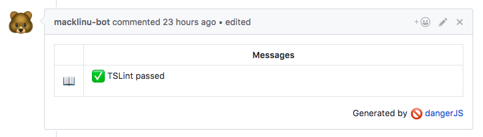
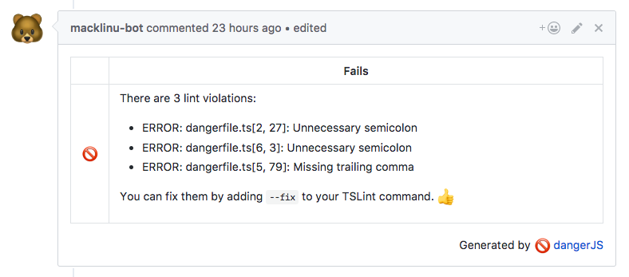

# danger-plugin-tslint

[](https://travis-ci.org/macklinu/danger-plugin-tslint)
[](https://badge.fury.io/js/danger-plugin-tslint)
[](https://github.com/semantic-release/semantic-release)
[](https://greenkeeper.io/)

> [Danger](https://github.com/danger/danger-js) plugin for TSLint


## Usage

### Setup TSLint

This Danger plugin requires that you output the TSLint results as a JSON file before running `danger` on CI.

One way to do this is to use TSLint's JSON formatter and [`tee`](https://en.wikipedia.org/wiki/Tee_(command)).

Given a `package.json` with a "lint" script:

```json
{
  "scripts": {
    "lint": "tslint 'src/**/*.{ts,tsx}'"
  }
}
```

Running `yarn run lint --silent -- --format json` will only output the JSON results, which are piped into `tee` and written to disk in the `reports/lint-results.json` file.

```sh
# ci-script.sh

mkdir -p reports/
yarn run lint --silent -- --format json | tee reports/lint-results.json

yarn run danger
```

> In this example, may also want to add the `reports/` directory to your `.gitignore` file, as this file does not need to be checked into source control.

### Setup Danger

Install:

```sh
yarn add danger-plugin-tslint --dev
```

At a glance:

```js
// dangerfile.js
import path from 'path'
import tslint from 'danger-plugin-tslint'

// Handle TSLint results in `reports/lint-results.json` and leave a Danger comment on the PR
tslint({
  lintResultsJsonPath: path.resolve(__dirname, 'reports', 'lint-results.json'),
})
```

By default `tslint()` will use the `defaultResultHandler` in [`src/resultHandlers.ts`](https://github.com/macklinu/danger-plugin-tslint/blob/master/src/resultHandlers.ts). If you want to supply a custom result handler, which also requires you to call Danger functions like `fail()` and `message()` , you can do that too:

```js
// dangerfile.js
import path from 'path'
import tslint from 'danger-plugin-tslint'

tslint({
  lintResultsJsonPath: path.resolve(__dirname, 'reports', 'lint-results.json'),
  handleResults: (results) => {
    if (results.length > 0) {
      const formattedResults = formatResults(results)
      fail(`TSLint failed\n\n${formattedResults}`)
    } else {
      message('👍 TSLint passed')
    }
  }
})
```

Here are examples of what the Danger comment will look like for success or failure:




See the [documentation](http://macklin.underdown.me/danger-plugin-tslint/modules/tslint.html#tslint-1) for detailed information (and also check out [`src/index.ts`](https://github.com/macklinu/danger-plugin-tslint/blob/master/src/index.ts)).

## Changelog

See the GitHub [release history](https://github.com/macklinu/danger-plugin-tslint/releases).

## Development

Install [Yarn](https://yarnpkg.com/en/), and install the dependencies - `yarn install`.

Run the [Jest](https://facebook.github.io/jest/) test suite with `yarn test`.

This project uses [semantic-release](https://github.com/semantic-release/semantic-release) for automated NPM package publishing.

The main caveat: instead of running `git commit`, run `yarn commit` and follow the prompts to input a conventional changelog message via [commitizen](https://github.com/commitizen/cz-cli).

:heart:
